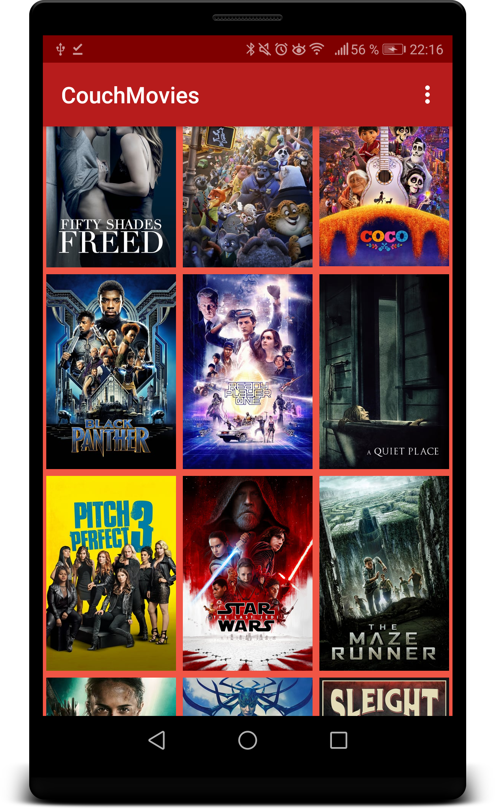
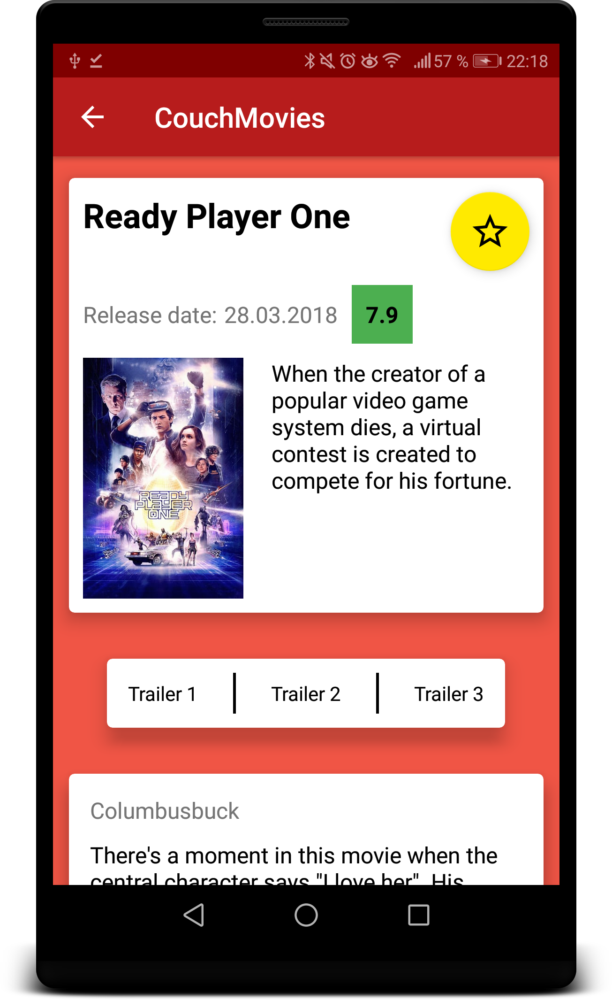

# CouchMovies

CouchMovies is an Android app to inspire the user what film to watch next. Therefore 
the user can browse through the most popular and highest ratest films of 
themoviedb.org. The app fetches the JSON-data from the server and stores the information
in a SQLite database via a content provider. 

By tapping on a movie poster additional details like
title, plot and rating are shown, trailers can be watched and user reviews can be read.

To get started clone the repository and get the code running in Android Studio.                                                            To fetch the data in this app, an API key from themoviedb.org is needed.
If you don’t already have an account, you will need to create one in order to request an API Key.
The key has to be added to the NetworkUtils java class as value of the variable API_KEY.

First the user can choose from a scrollable grid of movie posters:

By tapping on a poster the detail screen opens where the informations are presented.
The user can also choose a trailer to view or read user reviews. By tapping the star symbol
the user cann add movies to a favorites list:

